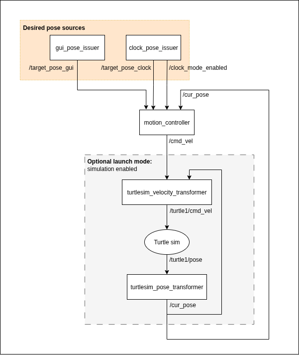

# ROS2-Infrastructure
Robotics software infrastructure for a ROS2 test environment

**Prerequisite**: [ROS 2 Install Instructions](docs/install_instructions.md).

**Using the Packages**: [Building and Running Instructions](docs/building_and_running_instructions.md).

**Testing and Formatting the Packages**: [Testing and Formatting Instructions](docs/testing_and_formatting_instructions.md).

## Author

[Emilia Psacharopoulos](https://github.com/EmiliaPsach).

*Note*: At the time of completing this coding challenge, I gad recently bought a new Mac M4 and attempted to install ROS 2 on it. However, because Macs are not not super compatible with ROS 2 yet, I borrowed somebody else's Ubuntu laptop and forgot to sign in on their git, which is why all my commits are from "joshsilv".

## Packages list

This repository has the following packages in the `src` directory:

1. **clock_pose_issuer**
    - Converts clock time to 6D poses on unit circle
1. **gui_pose_issuer**
    - GUI for user-desire manual 6D pose commands with an option for spacebar reset
1. **motion_controller**
    - Converts target poses to velocity commands
1. **turtlesim_pose_transformer**
    - Transforms turtlesim poses, from the turtlesim's reference, to a unit circle reference and publishes those poses as the current pose
1. **turtlesim_velocity_transformer**
    - Transforms velocity commands, from a unit circle reference, to the turtlesim's reference and publishes those commands to turtlesim

### Adding additional packages

Adding additional C++ packages in this repository is very straightforward:
1. Follow the existing structure of each package in this repo:
    - **Required**: CMakeLists.txt, package.xml, .cpp source code
    - **Optional; stylistic**: .hpp header, tests, separate node .cpp file
1. Add node to the launch script (robot_launch_system.py)

## Package Specifications

### Package connectivity

### Coordinate Systems

| Component              | Coordinate Frame         | Description                                                                                                                       | Allowed Actions                 | Responsibilities                                   |
| ---------------------- | ------------------------ | --------------------------------------------------------------------------------------------------------------------------------- | ------------------------------- | -------------------------------------------------- |
| `motion_controller`    | **World** `[-1, 1]`      | Global normalized frame, centered at (0, 0). Target positions are issued in this space.                                           | Compute `vx`, `vy`              | High-level path planning and control               |
| `pose_transformer`     | **World** `[-1, 1]`      | Maps raw `/turtle1/pose` (in 11×11 sim frame) into the normalized world frame. The turtle operates within a radius-0.7 subregion. | Transform turtle pose           | Converts `turtlesim` pose → world pose             |
| `velocity_transformer` | **Turtle's local frame** | Robot-centric body frame. Interprets linear and angular velocity commands relative to the robot's heading.                        | Accepts `linear.x`, `angular.z` | Converts world-frame velocity → body-frame command |

- The TurtleSim coordinate frame is a 2D Cartesian grid from (0, 0) in the bottom-left to (11, 11) in the top-right.
- The World frame is a normalized [-1, 1] × [-1, 1] space, centered at the origin.
    - 
- The Robot’s local (body) frame has the turtle at the origin (0, 0) facing right (along the positive x-axis). Velocity commands here are interpreted relative to this orientation.

### Topics list

| Node | Publishes (topics) | Subscribes (topics) |
| --- | --- | --- |
| clock_pose_issuer | `/target_pose_clock`, `/clock_mode_enabled` | |
| gui_pose_issuer | `/target_pose_gui` | |
| motion_controller | `/cmd_vel` | `/clock_mode_enabled`, `/target_pose_clock`, `/target_pose_gui`, `/cur_pose` |
| turtlesim_pose_transformer | `/cur_pose` | `/turtle1/pose` |
| turtlesim_velocity_transformer | `/turtle1/cmd_vel` | `/cmd_vel`, `/cur_pose` |
