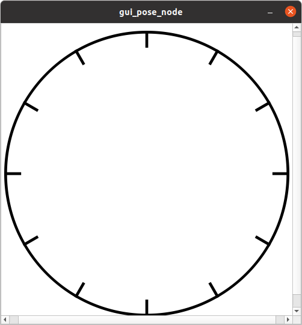

# GUI Pose Issuer

The `gui_pose_issuer` node provides a simple graphical user interface that allows users to publish 2D pose targets interactively by clicking inside a unit circle. It publishes `geometry_msgs/msg/PoseStamped` messages to a configurable topic based on mouse clicks within the GUI window. It also publishes a boolean flag to toggle between manual GUI control and an automatic clock-based pose mode.

---

## Features

- Interactive 2D GUI with a unit circle and clock-like ticks
- Click inside the circle to publish a pose at the clicked location
- Spacebar toggles clock mode (automatic pose following)
- Publishes pose messages and clock mode state as ROS 2 topics

---

## Topics

| Topic Name          | Message Type                    | Description                                  |
|---------------------|--------------------------------|----------------------------------------------|
| `/gui_pose`     | `geometry_msgs/msg/PoseStamped` | Publishes the 2D pose set by GUI interaction |
| `/clock_mode_enabled` | `std_msgs/msg/Bool`             | Publishes whether clock mode is enabled (true) or GUI mode (false) |

---

## Parameters

| Parameter   | Type    | Default   | Description                                  |
|-------------|---------|-----------|----------------------------------------------|
| `frame_id`  | string  | `"map"`   | The frame_id used in published PoseStamped messages |
| `topic_name`| string  | `"gui_pose"` | The topic name to publish PoseStamped messages |

---

## GUI Behavior



- The GUI shows a white unit circle with black hour tick marks (like a clock face).
- Clicking **inside** the unit circle publishes a pose corresponding to the clicked coordinates.
- The Y-axis in the GUI is inverted before publishing (to align with ROS coordinate conventions).
- Pressing the **spacebar** toggles clock mode ON, disabling GUI pose publishing and enabling an alternate automatic pose source.
- When clock mode is enabled or disabled, a boolean message is published on `/clock_mode_enabled`.

## Pose Message Semantics

- `pose.position.x` and `pose.position.y` correspond to the clicked point inside the unit circle (with Y inverted).
- `pose.position.z` is always 0.
- Orientation is fixed to the identity quaternion `(0, 0, 0, 1)` since the pose is purely positional in 2D.

---

## Example Usage

```bash
ros2 run gui_pose_issuer gui_pose_issuer_node
